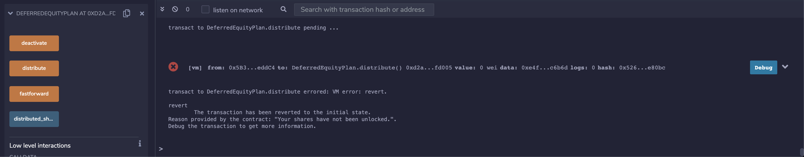
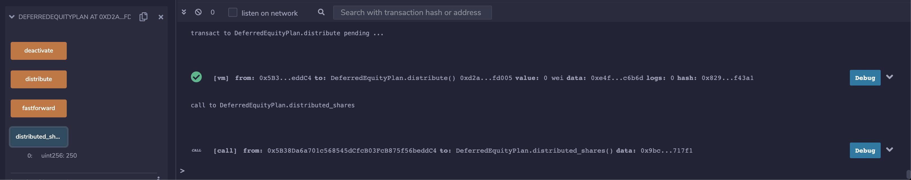
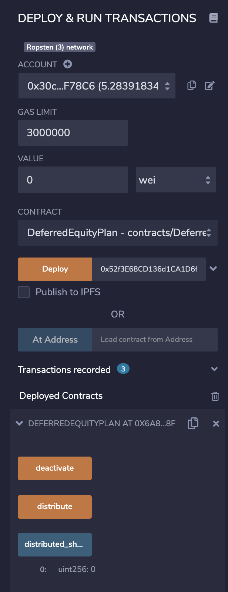
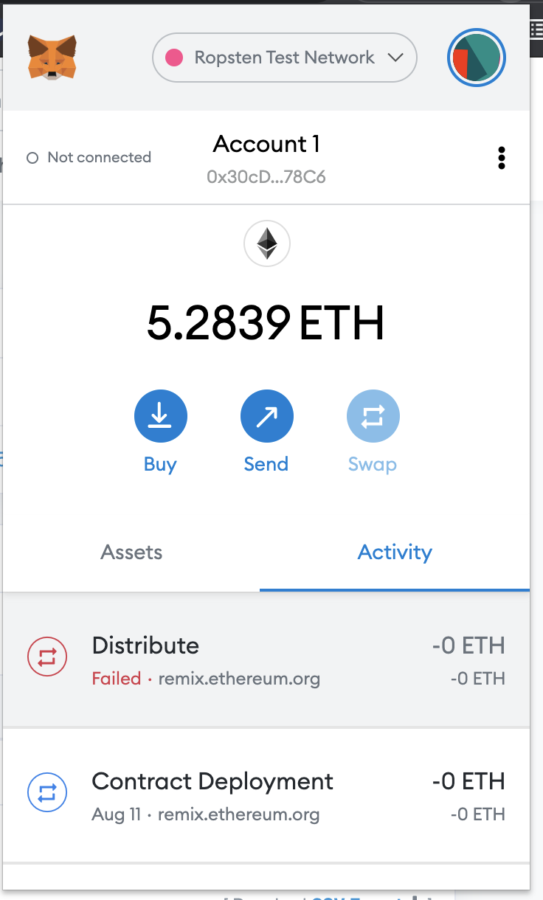
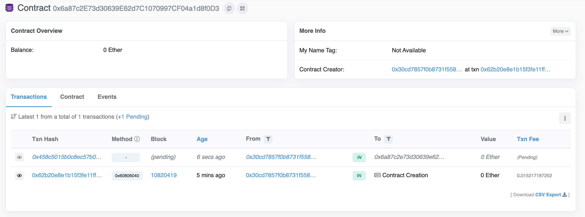
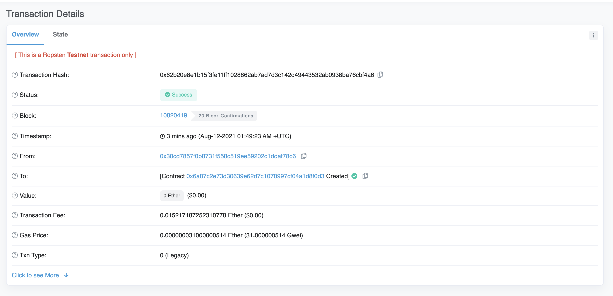

# 20-smart-contracts-w-solidity

### Contract 3 - DeferredEquityPlan

The purpose of this contract is to provide a decentralized way to keep track of an employee's deferred equity distribution according to the 4 year vesting schedule. Once a transaction is committed to the blockchain, it will be impossible to modify/forge things like distributed_shares, total_shares, unlock time etc. The implementation of the smart contracts can be found in DeferredEquityPlan.sol.

### Local Test
1. The above contract is deployed inside a JavaScript VM on Remix.
2. Attempting to distribute before unlock date will result in a failed transaction.

3. fast forward to a year later, then distribute. This time, the distribute transaction will be successful.

4. view your vested shares

### Deploy to Ropsten Test Net
1. Make sure you have some test ether to deploy the contract. If you don't have enough ether, request from one of the Ropsten faucets.
2. Similar to before, but this time, choose inject web3 instead of JavaScript VM. Connect to metamask, and deploy as before

3. You should be able to see contract being deployed on metamask

4. Once is transaction is broadcasted, you will be able to view it on etherscan

5. Once the deployment is successful, you will be able to submit transactions as before.

Contract address: 0x6a87c2E73d30639E62d7C1070997CF04a1d8f0D3
